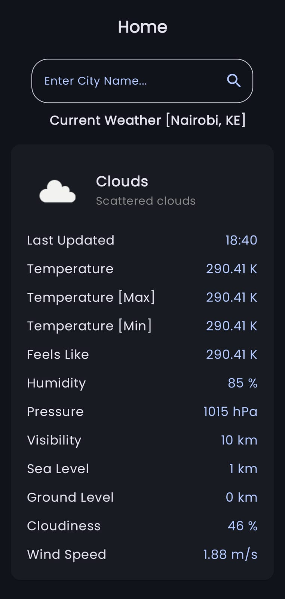
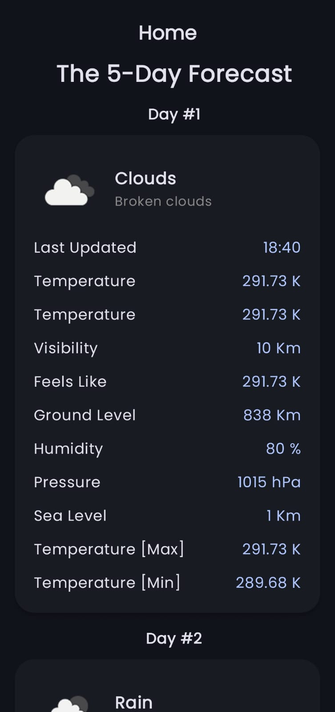

# Craft Silicon

## Overview

This is my solution for the Technical Assessment by Craft Silicon...

## Table of Contents

1. [Background](#1-Background)
2. [Architecture](#2-Architecture)
3. [Screenshots](#3-Screenshots)
4. [Testing](#4-Testing)
5. [Challenges & Solutions](#5-Challenges-and-Solutions)
6. [Credits](#6-Credits)
7. [How To Build](#7-How-To-Build)

## 1] Background

- This project is an implementation of the Mobile Interview Test offered by Craft Silicon...
- It utilises [The OpenWeatherMap API](https://openweathermap.org/api), specifically the following endpoints:

### a] The Current Weather Endpoint [/data/2.5/weather]

- This endpoint is used to retrieve the current weather details of a given area...

### b] The Forecast Weather Endpoint [/data/2.5/forecast]

- This endpoint is used to retrieve the forecast weather details of a given area...

## 2] Architecture

- Craft Silicon is a multi-module Android app implemented using the Model-View-ViewModel (MVVM) Architectural Pattern...
- It is divided into the following modules:

### a] :app

- This is the main module that houses the Main Activity, Application Class, and NavHost...
- MainActivity acts as the entry-point of the app following the Dependency Injection implementation, while CraftSiliconApplication initialises the app, and the NavHost defines the app's Navigation Hierarchy...

### b] :home

- This module contains the HomeScreen and its ViewModel...
- It is used to display both the Current Weather and Forecast Weather [5 Days] of a given city...

### c] :commons

- This module contains the resources that are used across multiple modules...

## 3] Screenshots

<table>
  <tr>
    <th>The Splash Screen</th>
    <th>The Home Screen [Current Weather]</th>
    <th>The Home Screen [Forecast Weather]</th>
  </tr>
  <tr>
    <td>
      
    </td>
    <td>
      
    </td>
    <td>
      
    </td>
  </tr>
</table>

## 4] Testing

| Test                                                                                                        | Description                               |
|-------------------------------------------------------------------------------------------------------------|-------------------------------------------|
|  | This is The Home Screen ViewModel Test... |
|                       | This is The Home Screen UI Test...        |
|                | This is The Craft Silicon DAO Test...     |

## 5] Challenges and Solutions

- One of the most significant challenges was mapping the Weather data across the multiple layers of the project. To solve this, Custom Mappers [Extension Functions] were used while also nullifying the values that were inconsistent across multiple entries to avoid crashes...
- Another challenge that was encountered was storing the nested data locally using Room. The workaround that was used to effectively handle this was using Room's "@Embedded" annotations, which allowed for the nested data to be flattened and used within a single table...
- For some reason, the Weather Icons were not being displayed when [Coil](https://coil-kt.github.io/coil/compose/) was being used. This was easily rectified by adopting [Glide](https://bumptech.github.io/glide/int/compose.html) instead...

## 6] Credits

- Craft Silicon has been built using the following Tools, Technologies, and Libraries:

a] [Jetpack Compose](https://developer.android.com/jetpack/compose)

- The app has utilised Google's modern UI toolkit [Jetpack Compose] for its User Interface that prioritises the Kotlin-first approach of Android App Development (AAD)...

b] [Koin](https://insert-koin.io/)

- For Dependency Injection using Kotlin, Koin has been used in conjunction with:

c] [KSP](https://kotlinlang.org/docs/ksp-overview.html)

- For faster builds regarding Annotations, Kotlin Symbol Processing [KSP] has been implemented as a plugin...

d] [Retrofit2](https://square.github.io/retrofit/)

- As a core library, Retrofit2 has been utilised for performing remote calls to the REST API through a level of abstraction...

e] [OkHTTP3](https://square.github.io/okhttp/)

- In addition to Retrofit2, OkHTTP3 has also been implemented to aid in configuring the remote calls by providing an Interceptor and specifying the expected data type as JSON...

f] [Kotlin Serialization Plugin](https://kotlinlang.org/docs/serialization.html)

- During the remote calls, the returned data has been serialized and deserialized using the Kotlin Serialization plugin...

g] [Splash Screen API](https://developer.android.com/develop/ui/views/launch/splash-screen)

- The app has implemented its Splash Screen using Google's Splash Screen API which uses its custom theme alongside the app's theme...

h] [LeakCanary](https://square.github.io/leakcanary/)

- To detect and fix memory leaks, LeakCanary has been implemented...

i] [MockK](https://mockk.io/) and [Kotlin Coroutines Test](https://kotlinlang.org/api/kotlinx.coroutines/kotlinx-coroutines-test/)

- During testing MockK has been used to mimic the dependencies to be tested resulting in a close-to-real test case scenario...
- The Unit Tests used the Kotlin Coroutines Test library to provide the Coroutine Scopes for the suspending functions that were being tested...

## 7] How To Build

1] To build the project, ensure you have the following requirements:

- [Android Studio](https://developer.android.com/studio)...
- Android Device or Emulator...
- [Open Weather API Key](https://openweathermap.org/appid)...
- The Libraries and Plugins listed above...

2] Next, clone this GitHub Repository into your local machine using Android Studio by navigating to "New > Project from Version Control"...

3] Copy and Paste the URL of this GitHub Repository and click "Clone"...

4] Let the project build using Gradle...

5] Once done, connect your Android Device to Android Studio by navigating to "Device Manager". You can also create an Emulator instead of using a physical Android Device...

6] Run the app by clicking "Run 'app'"...